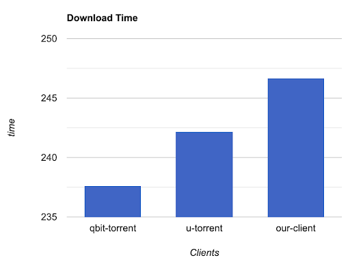
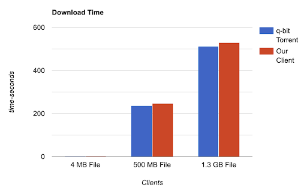
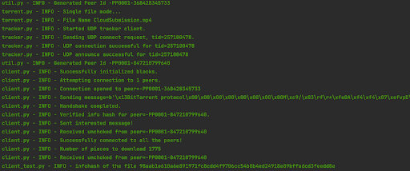

# Peer to Peer File Sharing Protocol

### Team Members: Aman Chaudhari, Akarsh Bolar, Ashitosh Dhapate, Kishan Kanyar, Mohit Mayank, Vignesh Somasundaram

## Problem Statement:
* Implement BitTorrent protocol based on the whitepaper published by Bram Cohen.
* Implement this P2P file sharing protocol from scratch with seeding and leeching in python with performance as a priority (using asynchronous library asyncio).
* Integrating using publicly hosted trackers for .torrent file sharing.
* Testing and validating file hashes in virtual environment.

## Motivation:
* To explore and understand the internals of a peer-to-peer protocol: BitTorrent
* Run our implementation of the protocol using virtual peers in Mininet
* Learn in depth about P2P file sharing.

## Challenges:
* Implementing leeching and seeding in the same client.
* Adding priority queue for connecting with peers.
* Deploying our application in mininet environment.
* Testing against other clients such as qbit-torrent & utorrent in different envirnoments and with different bandwidths.

## Results:

* After successful deployment of our P2P client on mininet we tested for downloading speed of our client against popular client utorrent and the most used open source client qbit-torrent and we observed that results were in par with the other clients with respect to the downloading speed.The qbit-torrent turned out to be superior in our experiment. The following figure shows the above mentioned results:

* We used different sized files to compare the downloading speed. The following figure shows the bar chart for different file sizes against the time taken by our client and q-bit torrent. We can observe that for a file size of 1.3 GB qBitTorrent took around 520 seconds to download and our client took around 535 seconds. We can state that as we increase the file size, our client and qbit-torrent has less difference in time taken to download the files

* We also tested the downloading speed on different networks with different bandwidths. We have also tested the same on a restricted network of Purdue university. We found qbit-torrent superior in all the different environments. The following figure shows the screenshot showing the working of our client. We can observe the processing of our client while downloading a file from other peer in the following figure.

* We also tested the hashes of the downloaded files. We can observe the same in the following table that the hash generated by QBit-torrent and our client is same for the downloaded files.

* Our Client - 98ab1e610a6e891971d24918e89bffadcd3feedd8e
* QBit-torrent - 98ab1e610a6e891971d24918e89bffadcd3feedd8e

## Conclusion:

Bittorrent is one of the most popular and powerful protocols for peer-to-peer file sharing. We started with the goal of understanding the internals of the Bittorrent protocol and aimed to implement it from scratch. We were successful in developing the protocol and implement it in the mininet environment. We compared the performance of our implementation with several other popular bittorrent clients and obtained comparable results. Bittorrent protocol is exciting with several applications such as on-demand video processing, clients downloading only required information and we are excited to extend our work with several enhancements as mentioned in the future scope below.

